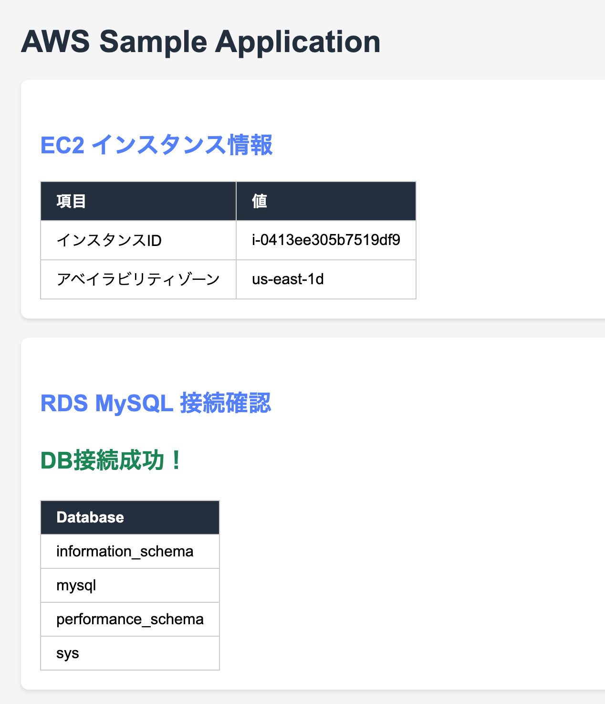

# Java Sample App (ALB + EC2/ASG + RDS MySQL)

ALB ヘルスチェック対応 & RDS MySQL 接続確認ができる Spring Boot アプリです。  
作業用EC2でデプロイ・動作確認 → AMI作成 → ASG → ALBターゲット の流れで使います。

## エンドポイント

| パス | 説明 |
|------|------|
| `/` | DB接続結果(SHOW DATABASES) + インスタンスID + AZ を表示 |
| `/health` | ALBヘルスチェック用 (`{"status":"UP"}`) |

---

## EC2 (Amazon Linux 2023) デプロイ手順

ターミナルでEC2に接続し、上から順にコマンドを貼り付けて実行してください。

### 1. Java 17 のインストール

```bash
sudo dnf install -y java-17-amazon-corretto-devel
```

Amazon Corretto 17 (Java 17) をインストールします。Spring Boot 3.x の実行に必要です。

### 2. Maven のインストール

```bash
sudo dnf install -y maven
```

Java プロジェクトのビルドツールです。ソースコードからJARファイルを生成するのに使います。

### 3. ソースコードのダウンロード

```bash
cd /home/ec2-user
wget https://github.com/trainocate-japan/JavaSample/archive/refs/heads/main.zip
unzip main.zip
mv JavaSample-main sample-app
```

GitHub からソースコードをZIPでダウンロードし、展開します。

### 4. アプリケーションのビルド

```bash
cd /home/ec2-user/sample-app
mvn clean package -DskipTests
```

Maven でソースコードをコンパイルし、実行可能なJARファイル (`target/demo-1.0.0.jar`) を生成します。

### 5. RDS 接続情報の設定

以下のコマンドの値を自分の環境に合わせて変更してから実行してください。

```bash
export DB_HOST='your-rds-endpoint.rds.amazonaws.com'
export DB_USER='admin'
export DB_PASS='your-password'
```

| 変数 | 設定する値 |
|------|-----------|
| DB_HOST | RDS の エンドポイント |
| DB_USER | RDS のマスターユーザー名 |
| DB_PASS | RDS のマスターパスワード |

### 6. アプリケーションの起動

```bash
sudo java -jar /home/ec2-user/sample-app/target/demo-1.0.0.jar \
  --spring.datasource.url="jdbc:mysql://${DB_HOST}:3306/?useSSL=false&allowPublicKeyRetrieval=true" \
  --spring.datasource.username="${DB_USER}" \
  --spring.datasource.password="${DB_PASS}" \
  > /home/ec2-user/app.log 2>&1 &
```

アプリケーションをポート80でバックグラウンド起動します。ログは `/home/ec2-user/app.log` に出力されます。  
ポート80は特権ポートのため `sudo` が必要です。  
データベース名は指定不要です（`SHOW DATABASES` はサーバーレベルで実行されます）。

### 7. 動作確認

```bash
sleep 5
curl http://localhost/health
```

`{"status":"UP"}` と表示されれば起動成功です。  
ブラウザで `http://<EC2のパブリックIP>/` にアクセスすると、DB接続結果とインスタンス情報が表示されます。

---

## 接続成功例



---

## AMI 作成後：ユーザーデータによる自動起動

AMI を作成し ASG の起動テンプレートに設定する際、以下をユーザーデータに記述するとインスタンス起動時にアプリが自動起動します。

RDS接続情報の3箇所を自分の環境に合わせて書き換えてください。

```bash
#!/bin/bash
dnf update -y
java -jar /home/ec2-user/sample-app/target/demo-1.0.0.jar \
  --spring.datasource.url='jdbc:mysql://your-rds-endpoint.rds.amazonaws.com:3306/?useSSL=false&allowPublicKeyRetrieval=true' \
  --spring.datasource.username='admin' \
  --spring.datasource.password='your-password' \
  > /home/ec2-user/app.log 2>&1 &
```

> **注意**: ユーザーデータは root 権限で実行されるため `sudo` は不要です。

## ALB ヘルスチェック設定

| 項目 | 値 |
|------|-----|
| ヘルスチェックパス | `/health` |
| ポート | `80` |
| 正常コード | `200` |
